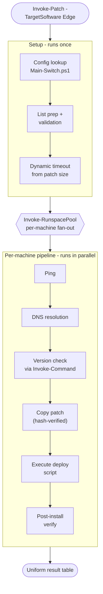

# Enterprise Patch Toolkit

Written by [Skyler Werner](mailto:skyler.werner@gmail.com).


[](#note-on-reuse)

PowerShell 5.1 toolkit for concurrent patching, remote remediation, and software inventory across fleets of Windows endpoints. Designed for enterprise environments where PowerShell 7 and third-party orchestration tools are not an option, and where dual segregated networks (primary / secondary) share a common operator workflow.


**Highlights**

- A reusable `Invoke-RunspacePool` engine that fans patch deployment out to hundreds of machines with per-task timeouts, progress bars, and a uniform result schema.
- A central `Main-Switch.ps1` configuration that reduces "add a new patchable app" to a single switch-case, and a content-aware three-way merge module (`Merge-MainSwitch`) that lets multiple admins maintain their own copies without drift.
- An environment-config layer (`Config\Environment.psd1` + `RSL-Environment` module) that keeps all org-specific values (domain names, file-share UNCs, trusted runner hostnames, CMDB tags) out of the scripts themselves, so the whole repo drops into a new environment by editing one file.
- Battle-tested against a known hazard of the platform: the double-serialization boundary introduced when `Invoke-RunspacePool` jobs call `Invoke-Command` into remote sessions. See [docs/ARCHITECTURE.md](docs/ARCHITECTURE.md) for the pattern.

> **Portfolio note:** This is a sanitized copy of a toolkit I built and maintained in production on the Marine Corps Enterprise Network (MCEN), covering a multi-thousand-endpoint Windows fleet. Production values for the env-config layer above ship here as placeholders in [Config/Environment.example.psd1](Config/Environment.example.psd1).

---

## Where to Start

If you are reviewing this for an interview and want the short tour, read these four files in order:

1. **[Modules/Invoke-RunspacePool/Invoke-RunspacePool.psm1](Modules/Invoke-RunspacePool/Invoke-RunspacePool.psm1)** -- The concurrency engine the rest of the toolkit is built on. Wraps a .NET `RunspacePool` with per-task timeouts, a unified progress bar, and a guaranteed result shape.
2. **[docs/ARCHITECTURE.md](docs/ARCHITECTURE.md)** -- Deep dive on the runspace + `Invoke-Command` double-serialization boundary. This is the single most load-bearing detail in the codebase and the most interesting thing I learned building it.
3. **[Scripts/Patching/Invoke-Patch.ps1](Scripts/Patching/Invoke-Patch.ps1)** -- The orchestrator. Shows the runspace pool in a production workload: dynamic timeout from patch size, ping/DNS/version-check/copy/execute/verify pipeline, uniform result-table output.
4. **[Modules/Merge-MainSwitch/Merge-MainSwitch.psm1](Modules/Merge-MainSwitch/Merge-MainSwitch.psm1)** -- Content-aware three-way merge for the central `Main-Switch.ps1` config file across multiple admins. The "switch-case level" merge resolves independent per-software edits cleanly without manual conflict resolution.

---

## Quick Start

### First-Time Setup

1. Place this entire folder on your admin workstation (or clone from the repository).
2. Open **PowerShell ISE** or **PowerShell Console** and run `Setup.ps1`:

   ```powershell
   # In ISE:  open Setup.ps1 and press F5
   # In Console:
   Set-ExecutionPolicy Bypass -Scope Process -Force
   .\Setup.ps1
   ```

3. Restart PowerShell. Your profile will now auto-import all modules and patching functions on every launch.
4. Open `Run.ps1` in ISE. It has ready-made invocations for the most useful scripts. Select the lines you need and press **F8** to run them.

### What Setup Does

- Copies the PowerShell profiles from `Profiles\` into your `Documents\WindowsPowerShell\` directory (where PowerShell loads them on startup).
- Writes a `Paths.txt` config file to `%APPDATA%\Patching\` so your profile knows where to find scripts and modules.
- Maps the `M:\` drive to the network patch repository (if not already mapped).
- Copies PSTools to your desktop (required for `.msu` deployments).
- Unblocks all script files (removes the "downloaded from the internet" flag).

### Re-Running Setup

Run `Setup.ps1` again whenever you pull updates. It detects profile changes automatically and only overwrites when the file has changed.

---

## Configuration

All environment-specific values live in a single PowerShell data file: [Config/Environment.example.psd1](Config/Environment.example.psd1). The scripts themselves reference nothing hardcoded.

### Dropping Into a New Environment

1. Copy the template to the active filename:

   ```powershell
   Copy-Item Config\Environment.example.psd1 Config\Environment.psd1
   ```

2. Edit `Config\Environment.psd1` and fill in your domain FQDNs, file-share UNCs, drive letter, trusted-runner hostname patterns, and org tag.
3. `Config\Environment.psd1` is gitignored. The example file stays in source control as documentation.
4. On a fresh clone where no `Environment.psd1` exists, scripts fall back to the example values so smoke tests still run (with a warning).

### What's Configurable

| Key | Purpose |
|-----|---------|
| `Networks[]` | One entry per domain. Each declares the FQDN, short name, and patch / log share UNCs. Scripts pick the active entry by matching `$env:USERDNSDOMAIN` at runtime. |
| `MappedDriveLetter` | Drive letter Setup maps to the active network's patch share. |
| `ShareAnchorPath` | Subpath under the mapped drive used to probe share health and locate the central copies of Main-Switch.ps1 and PSTools. |
| `CentralMainSwitchPath` | Path to the authoritative Main-Switch.ps1. Setup syncs the local copy against this. |
| `CentralPSToolsPath` | Path to PSTools (PsExec et al). Copied to the operator's desktop on trusted runners only. |
| `TrustedRunnerHosts[]` | Computer-name regex patterns for hosts allowed to pull centrally-hosted binaries. |
| `OrgComponentTag` | Label used by endpoint-agent integrations (e.g. Tanium question filters) to identify your org's machines. |

### How Scripts Read It

The `RSL-Environment` module exposes two functions used throughout the codebase:

```powershell
$cfg     = Import-RSLEnvironment        # hashtable of the whole config
$active  = Get-RSLActiveNetwork         # the entry matching $env:USERDNSDOMAIN, or $null
```

`Import-RSLEnvironment` caches the hashtable in script scope, so repeat calls are free. `Get-RSLActiveNetwork` returns `$null` for workgroup / non-domain machines. Callers treat that as "skip domain-prefix stripping" rather than a hard failure.

---

## Repository Structure

```
enterprise-patch-toolkit/
|
|-- Setup.ps1                     Entry point for first-time setup
|-- Run.ps1                       Quick-launch scratch pad (F8 in ISE)
|
|-- Config/                       Environment config (Environment.example.psd1)
|-- Modules/                      Reusable PowerShell modules (auto-imported by profile)
|   |-- RSL-Environment/              Loads Config\Environment.psd1; resolves active network
|   |-- Invoke-RunspacePool/          Concurrent execution engine
|   |-- Format-ComputerList/          Sanitizes computer name lists
|   |-- Get-Version/                  Extracts file/product versions remotely
|   |-- Get-RegistryKey/              Queries registry uninstall keys remotely
|   |-- Get-FileMetaData/             Reads Windows file metadata
|   |-- Get-DriverInfo/               Retrieves driver information via runspaces
|   |-- Get-DeepClone/                Deep-copies hashtables for state isolation
|   |-- Add-Delimiter/                Formats numeric properties for CSV export
|   |-- Invoke-RoboCopy/              Parallel file copy via robocopy and runspaces
|   |-- Test-ConnectionAsJob/         Parallel connectivity testing via background jobs
|   |-- Merge-MainSwitch/             Content-aware merge for Main-Switch.ps1 across admins
|   |-- ConvertTo-ExitCodeComment/    Converts exit codes to human-readable comment strings
|   |-- Copy-Log/                     Copies log files from remote machines to local folder
|
|-- Scripts/
|   |-- Main-Switch.ps1           Central config: defines all patchable software
|   |-- Patching/                 Core patching engine
|   |   |-- Invoke-Patch.ps1          Main patching orchestrator (see below)
|   |   |-- Invoke-Version.ps1        Version-check tool
|   |   |-- Default.ps1               Standard deployment template
|   |   |-- Default-NoUninstall.ps1   In-place update template
|   |   |-- Default-PSExec.ps1        PSExec-based deployment template
|   |   |-- AppUninstalls/            Per-application uninstall scripts
|   |   |   |-- Legacy/               Archived uninstall scripts (no longer actively used)
|   |   |-- SwitchBackups/            Auto-generated backups of Main-Switch.ps1
|   |-- Utility/
|   |   |-- Cleanup/              Cache, profile, and registry cleanup
|   |   |-- Discovery/            Software inventory and search tools
|   |   |-- Maintenance/          System health, drivers, WinRM, DNS, WU repair
|   |   |-- Remediation/          Targeted vulnerability fixes and bulk uninstalls
|
|-- Import-Export/                Package scripts for email/transfer
|-- Profiles/                     PowerShell profile templates
|-- Tests/                        Module test suites
```

---

## Using Invoke-Patch

`Invoke-Patch` is the primary tool. It reads a software definition from `Main-Switch.ps1`, builds a target list, and deploys patches to all machines concurrently.

### Basic Usage

```powershell
# Patch all machines on the Edge list
Invoke-Patch -TargetSoftware Edge

# Patch a single machine
Invoke-Patch -TargetSoftware Chrome -TargetMachine WORKSTATION01

# Short alias form
Invoke-Patch -TS Edge -TM WORKSTATION01
```

### Parameters

| Parameter | Alias | Description |
|-----------|-------|-------------|
| `-TargetSoftware` | `-TS`, `-Target` | **(Required)** Software name matching an entry in `Main-Switch.ps1`. |
| `-TargetMachine` | `-TM`, `-CN` | Target a single machine instead of the full list file. |
| `-Force` | | Run on all machines even if version check says compliant. |
| `-NoCopy` | | Skip the file-copy phase (useful for re-running installs). |
| `-CopyTimeout` | | Override the dynamic copy timeout (minutes, 0-90). |
| `-Timeout` | | Override the total operation timeout (minutes, 0-120). |
| `-ConfirmTimeout` | `-CT` | Prompt before killing timed-out tasks (default is auto-stop). |
| `-Isolated` | | Skip the initial ping (for machines where ICMP is blocked). |
| `-Verbose` | | Show detailed argument and pipeline info. |

### How It Works

1. **Config Lookup** -- Reads `Main-Switch.ps1` to get the software definition: target list path, compliant version, patch file location, deployment script, install commands, and process names.

2. **List Preparation** -- Loads the target machine list from `%USERPROFILE%\Desktop\Lists\<software>.txt` (or uses `-TargetMachine`). Cleans names with `Format-ComputerList`.

3. **Validation** -- Checks that the patch path exists, the list is populated, and PSTools are available (if needed).

4. **Dynamic Timeout** -- Calculates a timeout based on patch file size (small patches get 35 min, large ones up to 120 min). Can be overridden with `-Timeout`.

5. **Concurrent Deployment** -- Uses `Invoke-RunspacePool` to run the following pipeline on every machine in parallel:
   - **Ping** the machine (skip with `-Isolated`)
   - **DNS resolution** (handles both hostnames and IP addresses)
   - **Version check** via remote `Invoke-Command` (file version or registry lookup)
   - **Copy** patch files to `C:\Temp\` on the target (with hash verification)
   - **Execute** the deployment script (`Default.ps1`, `Default-NoUninstall.ps1`, or `Default-PSExec.ps1`)
   - **Post-install verification** to confirm the new version

6. **Results** -- Returns a table with columns: IP, ComputerName, Status, SoftwareName, Version, Compliant, NewVersion, ExitCode, Comment, AdminName, Date.



### Target Machine Lists

Machine lists are plain text files with one hostname per line, stored in:
```
%USERPROFILE%\Desktop\Lists\
```

The expected filename for each software is defined in `Main-Switch.ps1` (the `$listPath` variable). For example, Edge expects `Microsoft_Edge.txt`, Chrome expects `Google_Chrome.txt`.

### Adding New Software

To add a new patchable application, add a new case to the `switch` block in `Scripts\Main-Switch.ps1`:

```powershell
"MySoftware" {
    $listPath      = "$listPathRoot\MySoftware.txt"
    $software      = "My Software Name"
    $processName   = "myprocess"
    $compliantVer  = "1.2.3"
    $patchPath     = "$patchRoot\MySoftware\MySoftware_1.2.3"
    $patchScript   = (Get-Command "$scriptRoot\Patching\Default.ps1").ScriptBlock
    $softwarePaths = "C:\Program Files\MySoftware\app.exe"
    $installLine   = "& cmd /c 'C:\Temp\MySoftware_1.2.3\setup.exe /S'"
}
```

---

## Using Invoke-PatchGUI

`Invoke-PatchGUI` is a WPF front-end for `Invoke-Patch` and `Invoke-Version`. Same concurrent engine, same result schema, same sort order -- just rendered as a dialog instead of a prompt, for admins who prefer a clickable interface to a CLI.


### Parameter Parity

Every CLI parameter has a corresponding GUI control. These two invocations produce identical results:

```powershell
Invoke-Patch -TargetSoftware Photoshop -Force -CollectLogs -Timeout 30
```


### Themes

Twelve built-in themes. The gallery previews all twelve; pick one and the GUI relaunches in that theme, persisting the choice across sessions.


Both light and dark palettes are first-class. Cobalt Slate Day is the light variant of the flagship theme:


Themes can define their own XAML for non-standard layouts. CyberPunk Console replaces the canonical header with a bracketed HUD title, uses electric cyan on pure black throughout, and renames Run and Cancel to EXECUTE and ABORT:


---

## Using Invoke-Version

`Invoke-Version` checks installed software versions across machines without deploying anything. Useful for quickly auditing compliance before or after patching.

```powershell
# Check Edge versions across all listed machines
Invoke-Version -TargetSoftware Edge

# Check a single machine
Invoke-Version -TS Chrome -TM WORKSTATION01
```

---

## Quick-Launch Scratch Pad (`Run.ps1`)

`Run.ps1` is a ready-made reference file with invocations for the most commonly used scripts. Open it in ISE, tweak the arguments, highlight the lines you need, and press **F8** to run the selection.

- Uses full paths via a `$ScriptRoot` variable, so it works regardless of ISE's working directory.
- Function-based scripts are dot-sourced first, then called; standalone scripts use the `&` call operator.
- `$TargetMachines` is loaded automatically by the profile from `Desktop\Lists\Target_Machines.txt`.

---

## Utility Scripts

Standalone scripts in `Scripts\Utility\` are organized by purpose. Open them individually in ISE or Console to run, or use `Run.ps1` for quick access. Most follow this pattern:

1. Accept a `-ComputerName` parameter (or load from `$TargetMachines`)
2. Define a scriptblock with the remote logic
3. Run concurrently via `Invoke-RunspacePool`

| Category | Examples |
|----------|----------|
| **Cleanup** | Clear ConfigMgr cache, remove stale user profiles, remove stale registry uninstall keys, clean orphaned user registry keys |
| **Discovery** | Find patch content in ccmcache, get logged-in users, query registry, find installed software, Dell BIOS settings, test remote access |
| **Maintenance** | Repair machine health (SFC/DISM/SCCM), repair Windows Update agent, restart machines, enable WinRM, renew DNS, install drivers |
| **Remediation** | Log4J remediation, Tanium quarantine verification, MSI uninstall repair, user-scope software uninstalls |

---

## Syncing Main-Switch.ps1 Across Admins

When multiple admins maintain their own copy of the library, `Main-Switch.ps1` can drift between copies. The `Merge-MainSwitch` module provides content-aware merging with three exported functions:

```powershell
# Compare your local Main-Switch.ps1 against the central copy
Compare-MainSwitch

# Pull changes from the central copy into yours
Receive-MainSwitch

# Push your local changes to the central copy
Submit-MainSwitch
```

The module performs three-way merge at the switch-case level, so independent edits to different software entries merge cleanly without manual conflict resolution.

---

## Exporting / Importing the Library

The `Import-Export\` folder contains scripts for packaging the library for transfer to air-gapped or mail-restricted systems where cloning from source control is not an option:

- **Export-Package.ps1** -- Zips the entire library with `.txt` extensions on script files so the archive survives attachment filters that block executables. Supports delta exports: subsequent runs diff SHA-256 hashes against a reference manifest and ship only changed files.
- **Import-Package.ps1** -- Restores a package produced by `Export-Package.ps1`, restoring original extensions and directory structure.

---

## Modules

All modules are auto-imported by the PowerShell profile on startup. Each module includes a `.psd1` manifest for version tracking.

| Module | Version | Purpose |
|--------|---------|---------|
| `RSL-Environment` | 1.0.0 | Loads `Config\Environment.psd1` and resolves the active network profile for the current host |
| `Invoke-RunspacePool` | 2.0.1 | Concurrent execution with timeout handling and progress monitoring |
| `Format-ComputerList` | 1.0.1 | Strips domain prefixes/suffixes, deduplicates machine names |
| `Get-Version` | 2.0.0 | Extracts file/product versions remotely with wildcard and user-profile path support |
| `Get-RegistryKey` | 2.0.0 | Queries registry uninstall keys on remote machines for matching software entries |
| `Get-FileMetaData` | 1.0.0 | Reads Windows file metadata and digital signatures |
| `Get-DriverInfo` | 2.0.0 | Retrieves driver information from remote machines via runspaces |
| `Get-DeepClone` | 1.0.0 | Deep-copies hashtables to prevent reference leakage |
| `Add-Delimiter` | 1.0.1 | Formats space-separated numbers with delimiters for CSV |
| `Invoke-RoboCopy` | 1.0.0 | Copies files/directories to multiple remote computers in parallel via robocopy |
| `Test-ConnectionAsJob` | 1.1.0 | Parallel connectivity testing with Test-Connection -AsJob |
| `Merge-MainSwitch` | 1.0.0 | Content-aware three-way merge for Main-Switch.ps1 across multiple admins |
| `ConvertTo-ExitCodeComment` | 1.0.0 | Converts process exit codes to human-readable comment strings for patching results |
| `Copy-Log` | 1.0.0 | Copies log files from remote machines to a centralized local folder |

---

## Prerequisites

- Windows PowerShell 5.1 (Desktop edition)
- Admin credentials with remote access to target machines
- WinRM enabled on target machines
- Network access to the patch repository (UNC configured in `Config\Environment.psd1` under `Networks[].PatchShareUnc`)
- PSTools on your desktop for `.msu` deployments (Setup handles this on trusted runners)

---

## Further Reading

- [docs/ARCHITECTURE.md](docs/ARCHITECTURE.md) -- Deep dive on the runspace + `Invoke-Command` double-serialization pattern, why it bites, and the rule the codebase uses to avoid it.

---

## Note on Reuse

This code was developed for use on a US Government network. Accordingly, this repository is published **for portfolio review purposes only**. No license to fork, reuse, redistribute, or derive from this code is granted or implied.
