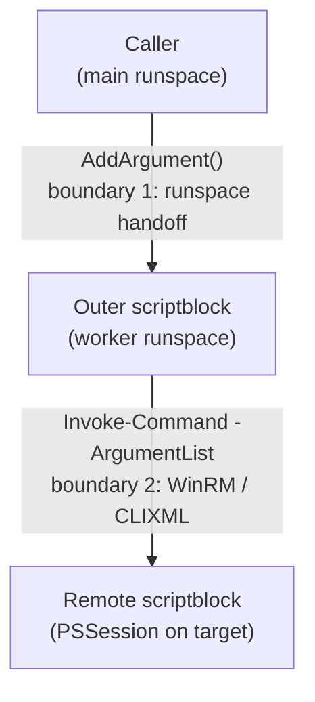

# Architecture Notes

This document covers the non-obvious design patterns in the Enterprise Patch Toolkit. It assumes familiarity with PowerShell 5.1 and remoting basics (WinRM, `Invoke-Command`, PSSessions).

## Contents

- [The Concurrent Execution Model](#the-concurrent-execution-model)
- [The Double-Serialization Boundary](#the-double-serialization-boundary)
- [The Environment Abstraction Layer](#the-environment-abstraction-layer)
- [Result Schema and Timeout Guard](#result-schema-and-timeout-guard)

---

## The Concurrent Execution Model

Most scripts that touch more than one machine route through `Invoke-RunspacePool` (in `Modules/Invoke-RunspacePool/`). This module wraps a .NET `RunspacePool` with:

- A configurable max-concurrent-jobs throttle.
- Per-task timeouts with auto-stop (and an optional `-ConfirmTimeout` mode that prompts before killing).
- A single progress bar that tracks completion across all jobs.
- Uniform result collection: every job returns a `[PSCustomObject]` with a known shape, regardless of whether it succeeded, timed out, or threw.

A typical call looks like:

```powershell
$results = Invoke-RunspacePool -ScriptBlock $sb -ArgumentList $argsArray -MaxThreads 50 -Timeout 10
```

Where `$argsArray` is a jagged array -- one inner array per target machine, each holding all the positional arguments the scriptblock expects.

## The Double-Serialization Boundary

This is the single most load-bearing detail in the codebase, and the reason for a specific idiom that appears in roughly a dozen scripts.

### The Setup

`Invoke-RunspacePool` feeds each inner argument array into a `PowerShell` instance via repeated `AddArgument()` calls. Scripts that run anything on a *remote* machine then use that outer scriptblock -- already inside a runspace -- to call `Invoke-Command -ComputerName <target> -ScriptBlock $remoteBlock -ArgumentList ...`.

That means any value passed from the caller into the remote block crosses **two** serialization boundaries:



### The Problem

Both boundaries serialize objects via CLIXML. For primitive scalars (`int`, `bool`, single `string`), the round-trip is lossless. For arrays and complex objects, what you get on the far side is a `Deserialized.*` type -- specifically `Deserialized.System.Object[]` for an array of strings.

`Deserialized.*` types have two relevant properties:

1. They don't implement implicit string conversion the way live CLR types do.
2. PowerShell's parameter binder for cmdlets like `Get-ChildItem`, `Test-Path`, `Remove-Item`, and most registry cmdlets doesn't coerce them.

So a scriptblock like:

```powershell
$remoteBlock = {
    param($searchPaths)
    Get-ChildItem $searchPaths -Recurse
}
```

works fine when you call it directly, but silently returns nothing (or throws `Cannot bind argument ... because it is null`) when `$searchPaths` arrives across two serialization hops as `Deserialized.System.Object[]`.

### The Rule

> Any array received from `$args[n]` that will be forwarded through `Invoke-Command -ArgumentList` and used as a path or string parameter in the remote block must be force-cast at the top of the remote block.

The idiom:

```powershell
$searchPaths   = [string[]]($searchPaths   | ForEach-Object { "$_" })
$searchStrings = [string[]]($searchStrings | ForEach-Object { "$_" })
```

`ForEach-Object { "$_" }` does the per-element string conversion by interpolation (which *does* work on deserialized scalars), and the outer `[string[]]` cast yields a live CLR array the binder will accept.

Scalars (`int`, `bool`, single `string`) do not need this treatment -- they survive deserialization with a usable type.

### Example

See `Scripts/Utility/Discovery/Find-PatchContent.ps1:108-109` for a canonical instance:

```powershell
$remoteBlock = {
    param($searchStrings, $searchPaths, $maxAge, $metaDataDef)

    Invoke-Expression $metaDataDef

    # Force-cast to string[] -- deserialized types from runspace args
    # fail implicit string conversion in Get-ChildItem -Path (PS 5.1)
    $searchStrings = [string[]]($searchStrings | ForEach-Object { "$_" })
    $searchPaths   = [string[]]($searchPaths   | ForEach-Object { "$_" })

    ...
    $files = @(Get-ChildItem $searchPaths -Recurse -Force -ErrorAction SilentlyContinue)
    ...
}
```

Without those two cast lines, `Get-ChildItem` silently returns nothing on every target, and the script reports "no matching files" on a fleet full of matching files.

### Why Not Just Use `[CmdletBinding()]` Param Types?

Typed `param()` blocks help but do not fully solve it. Strong-typing `[string[]]$searchPaths` in the param block coerces the top-level array, but does not guarantee per-element string conversion for nested arrays or for objects that contain arrays. The defensive `ForEach-Object { "$_" }` pass is cheap and uniform, so the codebase prefers it over fragile type annotations.

---

## The Environment Abstraction Layer

`Modules/RSL-Environment/` exists so that no other script in the repo has to hardcode a domain name, file-share UNC, or trusted-host regex. The design goals:

1. **One file to change.** Dropping the repo into a new environment means editing `Config/Environment.psd1`, nothing else.
2. **Dual-network friendly.** Environments with a primary and secondary (often isolated) network share the same tooling and workflow. The config's `Networks[]` array is matched against `$env:USERDNSDOMAIN` at runtime so the same code resolves the correct share automatically on each network.
3. **Runnable on a cold clone.** If `Environment.psd1` is missing, the loader falls back to `Environment.example.psd1` with a warning. Smoke tests work; production use requires the real file.
4. **Secrets stay out of source control.** `Environment.psd1` is gitignored. The example file is checked in as a schema reference.

The module exposes two functions:

- `Import-RSLEnvironment` -- returns the full config hashtable, caches it in script scope.
- `Get-RSLActiveNetwork` -- returns the `Networks[]` entry whose `DomainFqdn` matches the current `$env:USERDNSDOMAIN`, or `$null` for workgroup machines.

Callers treat `$null` as "skip domain-prefix stripping" rather than a hard failure, so the library stays usable on lab / non-domain boxes.

---

## Result Schema and Timeout Guard

Every patching and audit script converges on the same output shape so results are uniformly sortable, exportable, and comparable:

```
IP, ComputerName, Status, SoftwareName, Version, Compliant, NewVersion,
ExitCode, Comment, AdminName, Date
```

`Invoke-RunspacePool` guarantees that jobs which time out or throw still return an object of this shape -- populated with `Status = "Timeout"` or `Status = "Error"` and a `Comment` describing the failure. Callers never have to special-case a missing row; downstream `Format-Table` / `Export-Csv` code just works.

The post-processing guard that normalizes timed-out / failed results lives in each calling script, directly after the `Invoke-RunspacePool` call, and is a hard requirement. Without it, a timed-out job leaves a ragged object in the result array and the `Format-Table` output misaligns.

---

## Why PowerShell 5.1

The target environment ships Windows PowerShell 5.1 (Desktop edition) with no option to install PowerShell 7. Every pattern in this repo is chosen to work there:

- No null-coalescing (`??`), null-conditional (`?.`), or ternary (`?:`) operators.
- No `pwsh`-only cmdlets.
- `@()` wrapping for any collection that might be single-element (in 5.1, a single-element collection does not have `.Count`).
- UTF-8 **with** BOM on `.ps1` / `.psm1` / `.psd1` files. 5.1's ISE interprets BOM-less files as Windows-1252, which silently corrupts any multi-byte UTF-8 character. The project enforces ASCII-only content as a belt-and-suspenders measure on top of the BOM.
